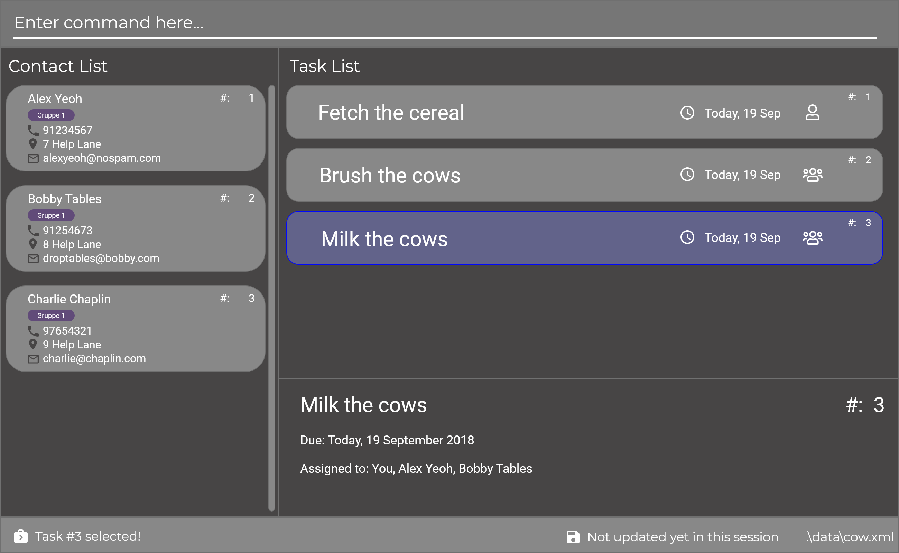

= Cow
ifdef::env-github,env-browser[:relfileprefix: docs/]

https://travis-ci.com/CS2103-AY1819S1-T9-1/main[image:https://travis-ci.com/CS2103-AY1819S1-T9-1/main.svg?branch=master[Build Status]]
////
https://ci.appveyor.com/project/damithc/addressbook-level4[image:https://ci.appveyor.com/api/projects/status/3boko2x2vr5cc3w2?svg=true[Build status]]
https://coveralls.io/github/se-edu/addressbook-level4?branch=master[image:https://coveralls.io/repos/github/se-edu/addressbook-level4/badge.svg?branch=master[Coverage Status]]
https://www.codacy.com/app/damith/addressbook-level4?utm_source=github.com&utm_medium=referral&utm_content=se-edu/addressbook-level4&utm_campaign=Badge_Grade[image:https://api.codacy.com/project/badge/Grade/fc0b7775cf7f4fdeaf08776f3d8e364a[Codacy Badge]]
https://gitter.im/se-edu/Lobby[image:https://badges.gitter.im/se-edu/Lobby.svg[Gitter chat]]
////

[quote, The Old Kroy Times]
____________________________________________________________________
The latest and greatest project management tool. You have to try it.
____________________________________________________________________

{sp} +
[quote, 24-7Mac]
____________________________________________________________________
The clean minimal UI fits perfectly with the image I want to project as a stylish Mac user.
____________________________________________________________________
{sp} +
[quote, Winter Singapore]
____________________________________________________________________
A simply outstanding piece of software. Unbelievable that this was built by a team of students.
____________________________________________________________________
{sp} +

ifdef::env-github[]

endif::[]

ifndef::env-github[]
image::images/Ui.png[width="600"]
endif::[]

* This is a desktop Address Book + Task Management application.
* One of our primary aims is to allow users to quickly and effectively manage their group projects.
* Cow has an extremely simple GUI that gets out of the way and lets you immerse yourself in the work that needs to be done.
* Our command line driven user interface allows you to achieve maximum productivity. Your fingers never need to leave the keyboard.

////
* It is a Java sample application intended for students learning Software Engineering while using Java as the main programming language.
* It is *written in OOP fashion*. It provides a *reasonably well-written* code example that is *significantly bigger* (around 6 KLoC)than what students usually write in beginner-level SE modules.
* What's different from https://github.com/se-edu/addressbook-level3[level 3]:
** A more sophisticated GUI that includes a list  panel and an in-built Browser.
** More test cases, including automated GUI testing.
** Support for _Build Automation_ using Gradle and for _Continuous Integration_ using Travis CI.
////
== Site Map

* <<UserGuide#, User Guide>>
* <<DeveloperGuide#, Developer Guide>>
* <<AboutUs#, About Us>>
* <<ContactUs#, Contact Us>>

== Acknowledgements
* This project is based off the excellent https://github.com/se-edu/[AddressBook-Level4] project created by the SE-EDU initiative.
* Libraries used: https://github.com/TestFX/TestFX[TextFX], https://bitbucket.org/controlsfx/controlsfx/[ControlsFX], https://github.com/FasterXML/jackson[Jackson], https://github.com/google/guava[Guava], https://github.com/junit-team/junit5[JUnit5]

== Licence : link:LICENSE[MIT]
