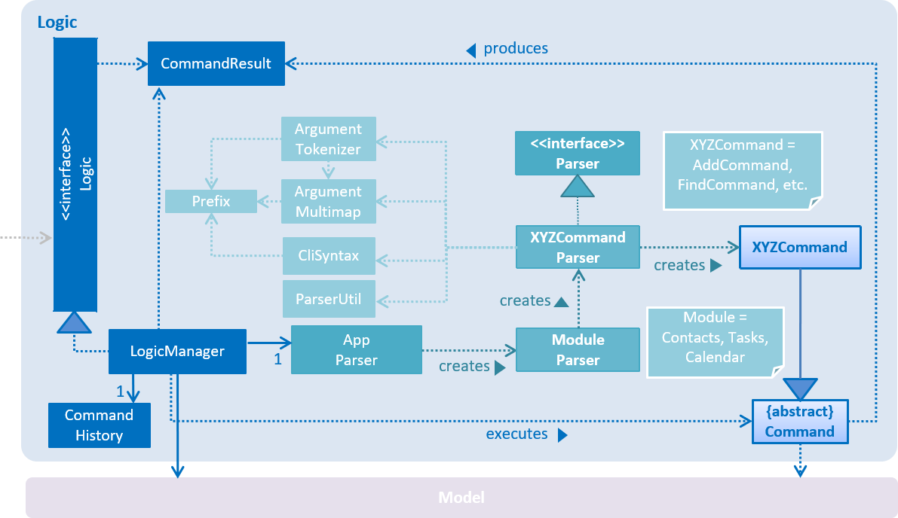
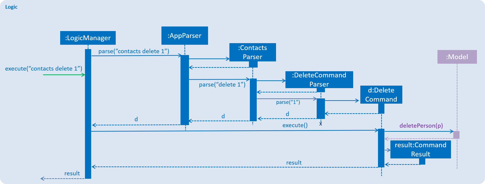
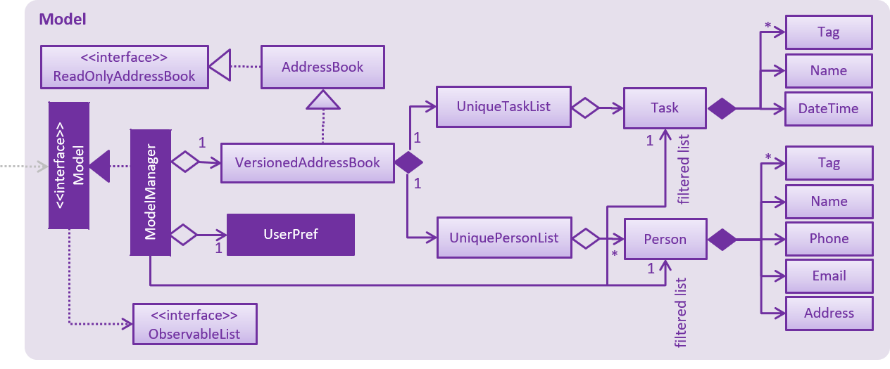
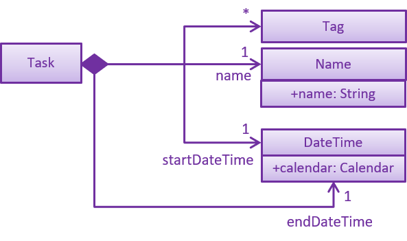
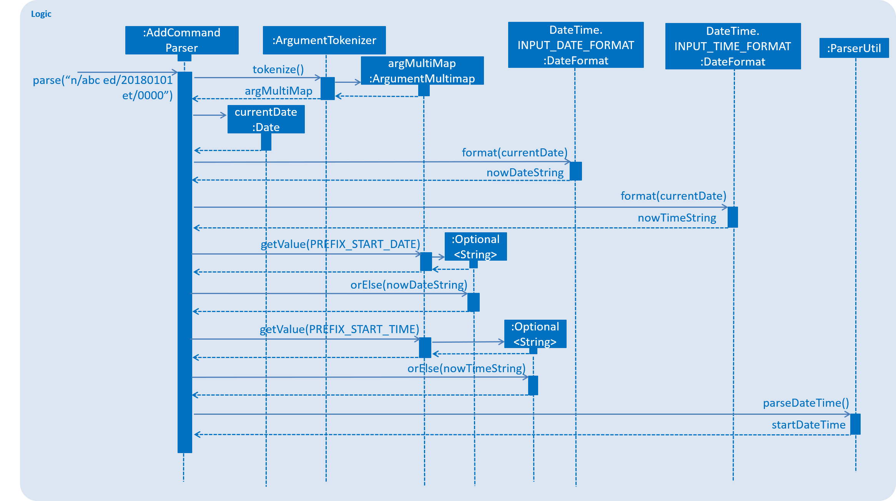

= Jolene Tan - Project Portfolio

== PROJECT: Cow

---

== Overview

Cow is a task management program with a view towards team projects. It includes an integrated contacts management module and assignment of tasks to contacts. Its command-line interface (CLI) is geared towards power users, letting them carry out operations efficiently without their hands leaving the keyboard.

This project portfolio documents my personal contributions to this project, including 1.5k lines of code (LoC) and contributions to user and developer documentation.

== Summary of contributions
This section documents the features I contributed to the project.

* *Major enhancement*: added *structural scaffolding for the tasks module*
** Created the logic for tasks. This included creating a parser for task commands, and implementing a two-level parser to direct user commands the parser for either the contacts module or the tasks module, maintaining modularity of the parsers.
** Created the model for tasks. This included auxillary classes including a DateTime class containing input validation and formatted text output tailored to this project.

* *Major enhancement*: added *ability to create tasks in Cow*
** Created a command for creating a task. Made start date and time of the task optional, defaulting to the date and time of the current moment.

== Contributions to the User Guide

|===
|_This section includes my contributions to the user guide, displaying my ability to write user-targeted documentation._
|===

=== Tasks

Format for entering dates is YYYYMMDD. Format for entering times is HHMM
in 24-hour time. (All commands from AB4 but prepend `tasks`)

==== View all tasks: `tasks list`

Format: `tasks list`

==== Add task: `tasks add`

Format:
`tasks add n/TASK_NAME [sd/START_DATE] [st/START_TIME] ed/END_DATE et/END_TIME [t/TAG]…`

If start date or time is not entered, the missing field(s) will default to the current date/time.

== Contributions to the Developer Guide

|===
|_You may see below my contributions to the developer guide, showcasing my technical writing skills as well as the technical depth of my code contributions._
|===

== Design

[[Design-Logic]]
=== Logic component

[[fig-LogicClassDiagram]]
.Structure of the Logic Component

*API* :
link:{repoURL}/src/main/java/seedu/address/logic/Logic.java[`Logic.java`]

.  `Logic` uses the `AppParser` class to parse the user command.
.  `AppParser` then sends the command to the appropriate module parser.
.  This results in a `Command` object which is executed by the `LogicManager`.
.  The command execution can affect the `Model` (e.g. adding a person) and/or raise events.
.  The result of the command execution is encapsulated as a `CommandResult` object which is passed back to the `Ui`.

Given below is the Sequence Diagram for interactions within the `Logic` component for the `execute("contacts delete 1")` API call.

.Interactions Inside the Logic Component for the `contacts delete 1` Command

[[Design-Model]]
=== Model component

.Structure of the Model Component

*API* : link:{repoURL}/src/main/java/seedu/address/model/Model.java[`Model.java`]

The `Model`,

* stores a `UserPref` object that represents the user's preferences.
* stores the Address Book data.
* exposes an unmodifiable `ObservableList<Person>` and `ObservableList<Task>` that can be 'observed' e.g. the UI can be bound to this list so that the UI automatically updates when the data in the list change.
* does not depend on any of the other three components.

== Implementation

// tag::tasks[]
=== Tasks class

The `Task` class consists of list of `Tag` objects and a `Name` object, corresponding to the same classes in the `Person` namespace. It also has two `DateTime` objects, one for the start date and time and the other for the end date and time of the task.

The `DateTime` class encapsulates a Java `Calendar` object to store a date and time. It also includes methods to parse and validate date/time inputs from the user, and methods to return the date or time as a `String`.
// end::tasks[]

// tag::addtasks[]
=== Addition of tasks
Adding a task is fairly straightforward. The user command is given to the parser, which validates the input and creates the task and the objects it is associated with. One aspect with a more involved implementation is the accomodation of optional start date and time fields in the user input, which is illustrated here.

1. The `AddCommandParser` receives the input string and calls `ArgumentTokenizer.tokenize()` to create an `ArgumentMultiMap`.
2. It then creates a Date object for the current moment in time and uses the `INPUT_DATE_FORMAT` and `INPUT_TIME_FORMAT` `DateFormat` s in `DateTime` to parse the Date object into date and time strings in the correct format.
3. It then retrieves the start date and start time strings from `argMultiMap`, which returns `Optional<String>` for each of them.
4. `orElse()` is then called on each `Optional<String>` to obtain the string encapsulated by the `Optional`, or the string for the current date/time if the `Optional` is empty.
5. Finally, `ParserUtil.parseDateTime()` is called with the resultant date and time strings.
// end::addtasks[]
